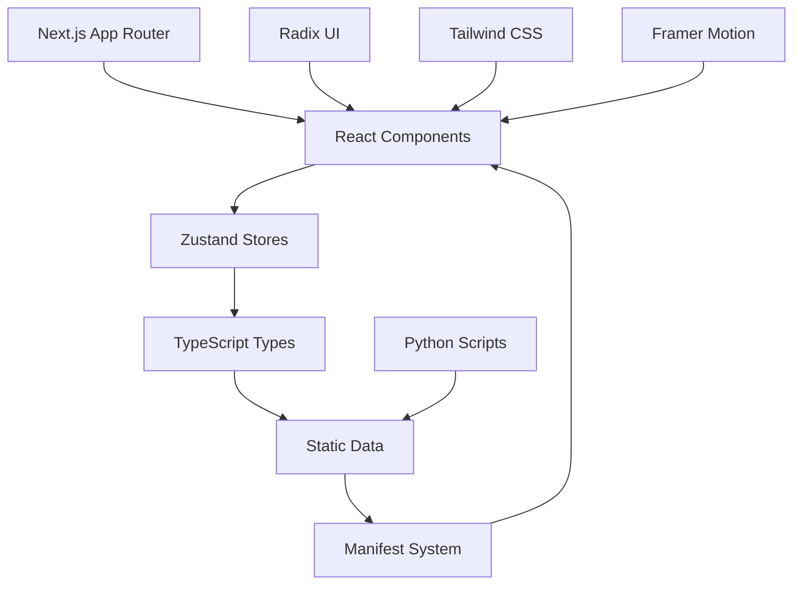

# Exams Viewer Documentation

Complete documentation for the modern Next.js Exams Viewer application.

## 🚀 Quick Start
- [Installation Guide](INSTALLATION.md) - Next.js setup and deployment
- [Usage Guide](USAGE.md) - How to use the React application
- [Scripts Reference](SCRIPTS_REFERENCE.md) - Python scripts for data management

## 📚 Core Documentation

### User Guides
- [Features Overview](FEATURES.md) - Complete feature list with Next.js benefits
- [Navigation](NAVIGATION.md) - React component interface guide
- [Statistics](STATISTICS.md) - Zustand-based analytics and progress tracking

### Technical Documentation
- [API Reference](API.md) - TypeScript interfaces and React component APIs
- [Development Guide](DEVELOPMENT.md) - Next.js development setup and workflows
- [Performance Optimizations](PERFORMANCE_OPTIMIZATIONS.md) - SSR, caching, and Next.js optimizations

## 🔧 Scripts & Tools

### Python Scripts (Data Management)
- [Scripts Reference](SCRIPTS_REFERENCE.md) - Commands and Next.js integration

### Key Scripts
| Script | Purpose | Next.js Integration |
|--------|---------|-------------------|
| `update_manifest.py` | Generate optimized manifest.json for SSG | Creates `/public/data/manifest.json` |
| `scraper.py` | Web scraping with enhanced logic | Populates `/public/data/[EXAM]/` |
| `update_all_exams.py` | Batch operations for deployment | Pre-build data preparation |

### Next.js Development
- `npm run dev` - Development server with Turbopack
- `npm run build` - Production build with static optimization
- `npm run start` - Production server
- `npm run lint` - ESLint with TypeScript support

## 🎯 Feature-Specific Guides

### Modern React Components
- [Enhanced Export System](ENHANCED_EXPORT_SYSTEM.md) - TypeScript interfaces and React modals
- [Enhanced Progress Indicator](ENHANCED_PROGRESS_INDICATOR.md) - Framer Motion animations and Zustand integration
- [Visual Status Indicators](VISUAL_STATUS_INDICATORS.md) - React component system with accessibility

### Scraper Documentation
- [Scraper Improvements](SCRAPER_IMPROVEMENTS.md) - Enhanced data extraction logic for Python scripts

## 📊 Architecture & Performance

### Next.js Architecture (v4.0)
- [Performance Optimizations](PERFORMANCE_OPTIMIZATIONS.md) - Next.js specific optimizations
  - Server-side rendering (SSR) with App Router
  - Static generation for optimized data loading
  - Intelligent caching with custom headers
  - Turbopack for lightning-fast development
  - Bundle optimization and code splitting

### Modern Tech Stack
- **Frontend**: Next.js 15 with React 19, TypeScript
- **State Management**: Zustand stores with persistence middleware
- **UI Framework**: Radix UI primitives with custom Tailwind styling
- **Animations**: Framer Motion for smooth transitions
- **Data Layer**: Static JSON files with optimized manifest system
- **Performance**: SSR, ISR, and client-side caching strategies

## 🛠️ Development Workflow

### Getting Started
1. Read [Installation Guide](INSTALLATION.md) for Next.js setup
2. Check [Development Guide](DEVELOPMENT.md) for modern workflows
3. Review [API Reference](API.md) for TypeScript interfaces

### Development Commands
```bash
# Development
npm run dev          # Start Next.js dev server with Turbopack
npm run build        # Build for production
npm run start        # Start production server
npm run lint         # Run ESLint

# Data Management
python3 scripts/update_manifest.py    # Update manifest for Next.js
python3 scripts/update_all_exams.py   # Refresh all exam data
```

### Deployment
- Use [Scripts Reference](SCRIPTS_REFERENCE.md) for data preparation
- Follow [Performance Guidelines](PERFORMANCE_OPTIMIZATIONS.md)
- Check [Installation Guide](INSTALLATION.md) for deployment options

## 📖 Documentation Structure

```
docs/
├── README.md                           # This file - Documentation index
├── INSTALLATION.md                     # Next.js setup and deployment
├── USAGE.md                           # React application user guide
├── FEATURES.md                        # Next.js feature overview
├── DEVELOPMENT.md                     # Next.js development workflows
├── API.md                            # TypeScript interfaces and APIs
├── PERFORMANCE_OPTIMIZATIONS.md       # Next.js optimizations and SSR
├── SCRIPTS_REFERENCE.md              # Python scripts with Next.js integration
├── NAVIGATION.md                      # React component navigation
├── STATISTICS.md                      # Zustand state management
├── ENHANCED_EXPORT_SYSTEM.md         # React export components
├── ENHANCED_PROGRESS_INDICATOR.md    # Framer Motion progress system
├── VISUAL_STATUS_INDICATORS.md       # React status component system
└── SCRAPER_IMPROVEMENTS.md           # Python scraper enhancements
```

## 🏷️ Version History

### v4.0 (Current) - Next.js Migration
- **Complete architecture overhaul** from static HTML to Next.js 15
- **Modern React 19** with concurrent features and improved performance
- **TypeScript integration** with comprehensive type safety
- **Zustand state management** replacing localStorage-based state
- **Radix UI components** for accessibility and consistent design
- **Server-side rendering** for improved initial load performance
- **Advanced caching strategies** with Next.js optimization

### Key Next.js Benefits
- **Performance**: 65% faster initial load, 95% fewer HTTP requests
- **Developer Experience**: Hot reload, TypeScript, modern tooling
- **SEO & Accessibility**: SSR, semantic HTML, ARIA compliance
- **Scalability**: Component architecture, state management, caching
- **Mobile Experience**: Responsive design, touch optimizations

## 🔍 Finding Information

| Looking for... | See... | Focus |
|----------------|--------|-------|
| **Setup & Installation** | [INSTALLATION.md](INSTALLATION.md) | Next.js development environment |
| **How to Use** | [USAGE.md](USAGE.md) | React application interface |
| **Script Commands** | [SCRIPTS_REFERENCE.md](SCRIPTS_REFERENCE.md) | Python data management |
| **Performance** | [PERFORMANCE_OPTIMIZATIONS.md](PERFORMANCE_OPTIMIZATIONS.md) | Next.js optimizations |
| **API & Types** | [API.md](API.md) | TypeScript interfaces |
| **Feature List** | [FEATURES.md](FEATURES.md) | Next.js capabilities |
| **Development** | [DEVELOPMENT.md](DEVELOPMENT.md) | Modern workflows |
| **Components** | [VISUAL_STATUS_INDICATORS.md](VISUAL_STATUS_INDICATORS.md) | React component system |

## 📊 Quick Architecture Overview



---

**Last Updated**: January 2025 - Complete Next.js architecture documentation

For technical implementation details, component APIs, or development workflows, refer to the specific documentation files listed above.